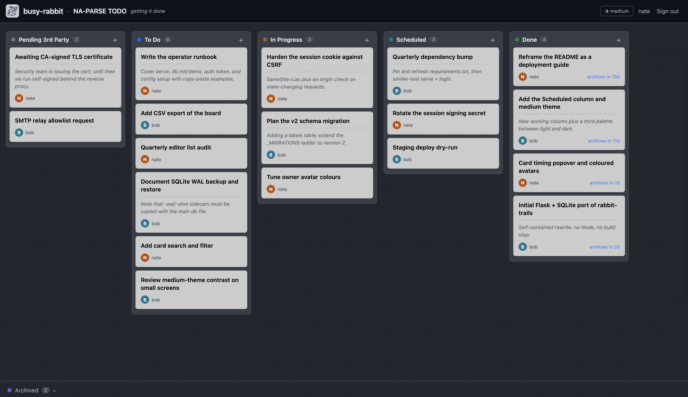

# busy-rabbit

A self-contained, self-hostable Kanban style / to-do work tracker. It is a 
Python + Flask + SQLite implementation with **no Node, no build step, and 
no external services** so it can be moved around and hosted locally 
for compliance.



## Quickstart

Requires Python 3.11+ (uses the stdlib `tomllib`). From the repo root:

```sh
# 1. Install dependencies
python3 -m venv .venv && source .venv/bin/activate
pip install -r requirements.txt

# 2. Create your config (guided wizard — writes config.toml)
./busy_rabbit config setup

# 3. Initialise the database
./busy_rabbit db init

# 4. Start the server
./busy_rabbit serve
```

Open the printed URL. To unlock editing, click **Sign in** — see
[Signing in](#signing-in) below. The fastest first-run path needs no SMTP:

```sh
./busy_rabbit auth token you@example.com   # you@... must be a configured editor
```

then visit `/login/token` and enter that email + token.

Prefer to hand-edit instead of the wizard? Copy the documented template and edit
it: `cp config.example.toml config.toml`.

## Signing in

The board is viewable without signing in (in `public` mode); **editing always
requires an editor session**. There is no password — identity is your email,
which must be listed under `[[board.editors]]`. Two ways to sign in:

| Method | How | Needs SMTP? |
| --- | --- | --- |
| **Email code** | Enter your email → receive a 6-digit code → enter it. | Yes |
| **CLI token** | Run `busy_rabbit auth token <email>`, then sign in at `/login/token` with the email + token. | No |

Sessions last 30 days. Editors are re-checked against `config.toml` on every
request, so removing an editor revokes access immediately.

## Features

- Five working columns — **Pending 3rd Party**, **To Do**, **In Progress**,
  **Scheduled**, **Done** — plus a derived **Archived** drawer for Done cards
  older than the configured window (default 14 days).
- Drag-and-drop reordering within a column and moves between columns, using
  midpoint positioning so existing cards never need rewriting.
- Inline card create / edit / delete, with a free-form **notes** body shown
  beneath the title in a softer tone.
- GitHub-style light and dark themes (remembered per browser).
- Email-based editor auth (emailed one-time code or CLI prevalidation token);
  no passwords, no external identity provider.
- Two access modes: `public` (anyone may view, read-only) or `closed`
  (sign-in required for any access).
- Owner names shown on cards when more than one editor is configured.
- Rotating logs under `./logs`.

## CLI

All commands accept a global `--config PATH` to use an alternate config file
(default: `config.toml` at the repo root). Run `./busy_rabbit <command> --help`
for any command's own help.

```sh
./busy_rabbit --config PATH <command>   # use an alternate config file
```

| Command | Options | Description |
| --- | --- | --- |
| `serve` | `--host H`, `--port P`, `--debug` / `--no-debug` | Start the web server. Options override `[server]` from config. |
| `db init` | — | Create the database schema if needed. |
| `db demo` | `-f`, `--force` | **Destructive.** Replace the database with ~20 sample cards spanning every column (and the archived shelf) for demos/evaluation. Prompts before overwriting an existing database unless `--force`. |
| `db list` | — | List cards in a compact table. |
| `db dump` | `-o`, `--output FILE` | Dump all cards as JSON (to a file, else stdout). |
| `db stats` | — | Show card counts grouped by effective status. |
| `auth token` | `<email>` (required) | Mint a 24h prevalidation token for a configured editor; sign in at `/login/token`. |
| `config setup` | — | Interactive guided wizard; writes a commented `config.toml` (backs up any existing file). |
| `config show` | — | Print the resolved config, the session-secret location, and validation status. The SMTP password is never printed, and a leftover `[security] secret_key` is flagged as removable. |
| `logs tail` | `-n`, `--lines N` (default 40) | Print the tail of `logs/busy_rabbit.log`. |

Ctrl+C exits any command cleanly (no traceback).

## Configuration

All settings live in `config.toml` (see `config.example.toml` for the full,
documented template, or run `./busy_rabbit config setup`). Key points:

- `[[board.editors]]` must list at least one entry, each with a valid `email`;
  otherwise the board stays read-only (an in-app banner explains this). An
  optional `nickname` becomes the card owner label (else the email local part).
- `[server] mode` is `public` (open read-only viewing) or `closed` (sign-in
  required for any access).
- The secret that signs session cookies is **not** a setting. It is generated
  automatically on first start and stored in `data/server.secret` (mode 0600,
  beside the database), then reused on every later start. Operators never set
  it. Deleting the file simply mints a new one, which logs everyone out.
- `[smtp]` delivers one-time login codes and is required for the email sign-in
  flow; the CLI token flow works without it. Auth is used only when **both**
  `username` and `password` are set.
- Set `[server] host = "0.0.0.0"` to expose the app on your network.
- `[server] use_https = true` serves directly over HTTPS with a self-signed
  certificate (see below). Default `false`.
- Paths in `[database]` and `[logging]` are relative to the repo root.

### HTTPS

For small, single-host deployments busy-rabbit can serve HTTPS itself instead
of needing a reverse proxy. Set `[server] use_https = true`. On the next
`./busy_rabbit serve`, a self-signed certificate and key are generated next to
the database (`data/busy-rabbit-cert.pem` and `data/busy-rabbit-key.pem`) and
reused on later starts. Browsers will warn about the self-signed certificate;
accept the exception to proceed.

The cert/key location is fixed and not configurable. To rotate the pair, delete
both files and start again — a fresh pair is generated. If `use_https` is on but
the existing files are present and invalid, the server refuses to start rather
than overwrite them.

Self-signed is the only built-in option. For a CA-signed (publicly trusted)
certificate, leave `use_https = false` and terminate TLS at a reverse proxy in
front of the app (see [Advanced deployment](#advanced-deployment)).

## Advanced deployment

`./busy_rabbit serve` runs Flask's built-in (Werkzeug) server. That is fine for
small, single-host, low-traffic use — the typical busy-rabbit deployment. If you
want a hardened production setup, a reverse proxy and/or a dedicated WSGI server,
the application exposes a standard WSGI factory you can point any server at:

```python
br_server:create_app   # callable returning a configured Flask app
```

With no arguments it loads `config.toml` from the repo root (resolved from the
package location, not the working directory). Run these commands from the repo
root with your virtualenv active so `br_server` is importable. To use a config
elsewhere, wrap the factory: `br_server:create_app` accepts a `config_path`
argument.

### Reverse proxy (recommended for public HTTPS)

The cleanest production model is to let a reverse proxy (nginx, Caddy, Apache)
own the public HTTPS endpoint and forward to busy-rabbit over plain HTTP on the
loopback interface:

1. Leave `use_https = false` and set `[server] host = "127.0.0.1"` so the app is
   only reachable through the proxy.
2. Point the proxy at `http://127.0.0.1:<port>` and have it terminate TLS with
   your CA-signed certificate.

This gives you trusted certificates, HTTP/2, and standard proxy logging without
busy-rabbit managing any of it.

> **Note on the `Secure` cookie flag.** The session cookie is marked `Secure`
> only when `use_https = true`. In the reverse-proxy model the app serves plain
> HTTP, so the cookie is not flagged `Secure` even though browsers reach you over
> HTTPS. The session still works (it remains `HttpOnly` and `SameSite=Lax`); the
> flag is simply not asserted. If you require it, restrict the app to the
> loopback interface (step 1 above) so the cookie never traverses an untrusted
> network in the first place.

### waitress (cross-platform, no compiler)

[waitress](https://github.com/Pylons/waitress) is a pure-Python production WSGI
server — no build step or compiler, matching busy-rabbit's no-dependencies-heavy
ethos, and it runs on Linux, macOS, and Windows alike. Install it and point it at
the factory:

```sh
pip install waitress
waitress-serve --listen=0.0.0.0:8000 --call br_server:create_app
```

waitress does not terminate TLS itself; pair it with the reverse proxy above for
HTTPS.

### Other WSGI servers

Any WSGI server can run the same `br_server:create_app` factory — for example a
prefork server like gunicorn on Linux. Consult that server's own documentation
for the invocation and process management; busy-rabbit needs nothing special
beyond the factory above.
